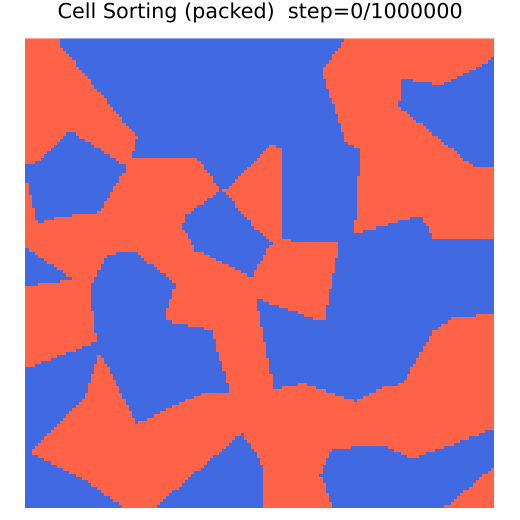
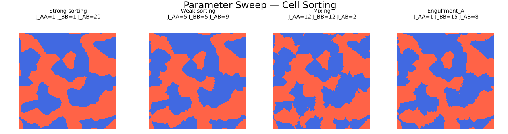
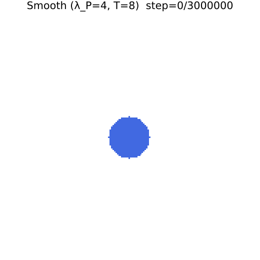

# CPM Cell Sorting & Cancer Morphology Simulator

セルラーポッツモデル (Cellular Potts Model, CPM) を用いて、細胞の自己組織化（Cell Sorting）と腫瘍細胞の形態変化を再現した Julia シミュレーターです。

本プロジェクトは、学部1年次に「生命の普遍原理に迫る研究体験ゼミ」として某研究室にて実施した研究プロジェクトの成果物です。統計力学的なエネルギー最小化原理を用いて、生物学的現象を計算機上で再現することを目的としています。

## 👤 Author

- **三宅 智史 (Satoshi Miyake)**
- GitHub: [@Ayuphys789](https://github.com/Ayuphys789)

---

## 📚 モデルの概要

### ハミルトニアン (エネルギー関数)

本シミュレーションでは、以下のハミルトニアンに基づくメトロポリス法を用いて、細胞配置の時間発展を計算しています。

$$
H = \sum_{\langle i,j \rangle} J(\tau_i, \tau_j)\,(1 - \delta_{\sigma_i,\sigma_j})
  + \sum_\sigma \lambda_V (V(\sigma) - V_\text{target})^2
  + \sum_\sigma \lambda_P (P(\sigma) - P_\text{target})^2
$$

| 項                       | 物理的意味     | 生物学的解釈                                                  |
| ------------------------ | -------------- | ------------------------------------------------------------- |
| **接触項 $J$**           | 界面エネルギー | 細胞間接着の強さ (カドヘリン等)。$J$ が大きいほど接着を嫌う。 |
| **体積項 $\lambda_V$**   | 弾性エネルギー | 細胞質の非圧縮性。細胞を一定の大きさに保つ。                  |
| **周囲長項 $\lambda_P$** | 膜張力・弾性   | 細胞膜の滑らかさ。$\lambda_P$ が大きいほど円形を好む。        |

### アルゴリズム

- **Metropolis Algorithm:** ランダムに格子点を選択し、隣接する細胞のIDで上書きを試行。エネルギー変化 $\Delta H$ に基づき確率的に受理/棄却を決定。
- **Optimization:** $\Delta H$ の計算において、変更がある局所的な領域のみを計算することで高速化を実現。

---

## 💻 実行方法

### 必要要件

- Julia 1.x
- Packages: `Plots`, `ProgressMeter`, etc.

### セットアップと実行

```bash
# 依存パッケージのインストール（初回のみ）
julia --project=. -e "using Pkg; Pkg.instantiate()"

# シナリオ 1: Cell Sorting
julia --project=. src/cell_sorting_cpm.jl 1

# シナリオ 2: パラメータスイープ (Parameter Sweep)
julia --project=. src/cell_sorting_cpm.jl 2

# シナリオ 3: 腫瘍細胞表面形態 (Tumor Morphology)
julia --project=. src/cell_sorting_cpm.jl 3
```

---

## 🧪 シナリオ 1: Cell Sorting

2種類の細胞（A:青, B:赤）をランダムに配置し、**Differential Adhesion Hypothesis (DAH)** に基づく自己組織化を再現します。

### 設定

異種細胞間の接着コストを高く設定 ($J(A,B) \gg J(A,A) \approx J(B,B)$) することで、同種の細胞同士が凝集し、表面エネルギーを最小化しようとします。

### 結果

時間の経過とともに、エントロピーによる混合状態から、エネルギー的に安定な分離状態へと移行する様子が確認できます。



---

## 🧪 シナリオ 2: パラメータスイープ (相図の探索)

接着パラメータ $J$ のバランスを変えることで、細胞集団がどのようなパターンを形成するか（Sorting, Mixing, Engulfment）を実験します。

| 条件               | $J_{AA}$ | $J_{BB}$ | $J_{AB}$ | 挙動の解釈                                     |
| ------------------ | -------- | -------- | -------- | ---------------------------------------------- |
| **Strong sorting** | 1.0      | 1.0      | 20.0     | 界面張力が非常に強く、完全分離して円形になる   |
| **Weak sorting**   | 5.0      | 5.0      | 9.0      | 分離はするが、界面が揺らぐ                     |
| **Mixing**         | 12.0     | 12.0     | 2.0      | 異種接着を好むため、市松模様のように混ざり合う |
| **Engulfment**     | 1.0      | 15.0     | 8.0      | 表面張力の差により、片方がもう片方を包み込む   |

### 結果



---

## 🧪 シナリオ 3: 腫瘍細胞表面形態

単一の腫瘍細胞における**浸潤性**と**膜の形状**の関係をシミュレートします。

### 条件比較

- **Smooth ($T=8, \lambda_P=4.0$):** 膜張力が強く、熱ゆらぎが小さい → 良性腫瘍のように滑らかな円形。
- **Jagged ($T=28, \lambda_P=0.0$):** 膜制約がなく、熱ゆらぎが大きい → 悪性腫瘍のように周囲へ浸潤する樹状構造（フィンガリング）。

### 結果

|                  Smooth (安定)                   |              Jagged (浸潤・不安定)               |
| :----------------------------------------------: | :----------------------------------------------: |
|  |  |

---

## ⚙️ 主要パラメータ

| 変数名     | デフォルト | 説明                                   |
| ---------- | ---------- | -------------------------------------- |
| `NX`, `NY` | 150, 150   | シミュレーション空間のサイズ           |
| `T`        | 15.0       | 温度パラメータ（細胞膜の揺らぎに寄与） |
| `V_target` | 50         | 細胞の目標体積                         |
| `J_matrix` | 3×3行列    | 細胞タイプごとの接着エネルギー行列     |

---

## 📂 ファイル構成

```text
cell-sorting/
├── src/
│   └── cell_sorting_cpm.jl   # シミュレーション本体
├── gif/                      # 出力結果 (アニメーション)
├── fig/                      # 出力結果 (静止画比較)
├── Project.toml              # Julia依存関係定義
└── Manifest.toml
```

## 📜 License

This project is licensed under the [MIT](LICENSE) License.

## 🔗 References

1. Graner, F., & Glazier, J. A. (1992). Simulation of biological cell sorting using a two-dimensional extended Potts model. _Physical Review Letters_, **69**, 2013.

1. Glazier, J. A., & Graner, F. (1993). Simulation of the differential adhesion driven rearrangement of biological cells. _Physical Review E_, **47**, 2128.
